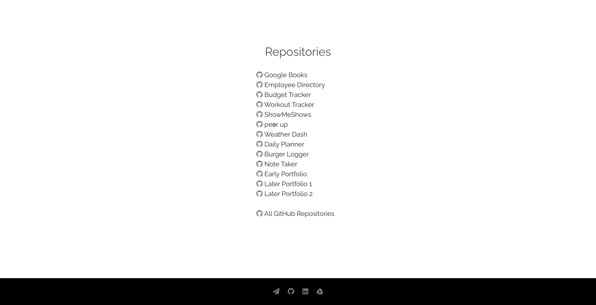
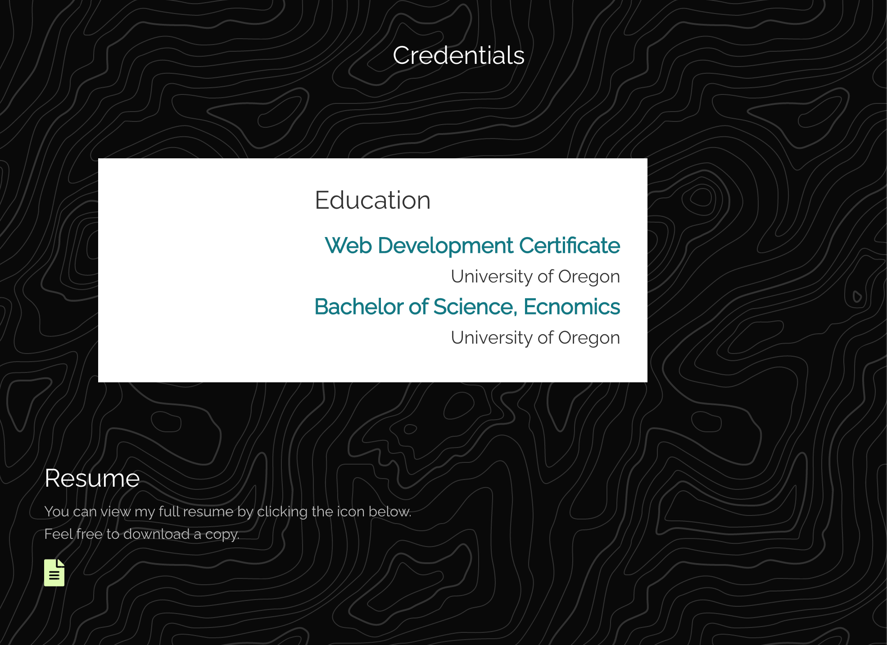

# Portfolio-Masonry

## Links to Project

[Live link](https://sarahvivoliportfolio.herokuapp.com/)  
[GitHub Repository](https://github.com/svivoli/portfolio-Masonry)

## Description

Portfolio site to showcase my work as a developer as well as serve as a platform for employers, clients, and colleagues to contact me and view my credentials.

## Modules/Technologies

- React
- Express
- Node
- Bootstrap
- UIKit
- Foundation

## Website Components

Home Page:
1. Hero with title and navigation tabs
2. About section
    - transforming image
3. Skills section
4. Profiles section
    - linked, transforming icons
5. Credentials section
    - linked, transforming icon
6. Bootcamp link section
    - Parallax background image
7. Contact section
8. Footer
    - linked icons
- Bootstrap grid system
- Responsive
Portofolio Page:
1. Featured images for each work
2. Hover effect
    - title and description
    - link to project
3. Index of GitHub repository links
4. Footer
    - linked icons
- Bootstrap grid system
- Responsive

## User Experience

Both pages are continuous scroll. The color scheme is drawn from the hero image which was chosen to reflect where I live and to create a tranquil mood throughout the page.

The site has a large hero where users can navigate between the home and portfolio page. On the home page, the first section below the hero is an about section, containing a short bio.

Below the bio section is a skills section, which lists my technical skills in the form of disabled buttons. The next section allows users to navigate to my LinkedIn and GitHub profiles via linked icons.

The next section lists my academic credentials as well as a linked icon so that users may navigate to a google doc to view my full resume rather than cluttering my portfolio page with too much listed information. It was also an easy way to have my resume accessible. Below the credentials section is a short section with a link to the home page of the U of O boot camp program that I attended so that user's can learn more about it if they wish. This entire section is a parallax image and moves as the user scrolls.

The last section is a contact section where my email address and phone number are displayed. Below the contact section is a footer that contains linked icons to send me and email, view my GitHub profile, visit my LinkedIn profile, and view my resume, icons that are found across the site that I decided to group in the footer for easy access.

The portfolio page has the same hero, and a short blurb describing how the page is set up.

The projects are displayed in a grid, each featured by a snapshot of the site.

What the user hovers over a project, the project's title and description are displayed overtop, as well as a link to view the live application in a new window.

Below the grid of projects is an index of links to the GitHub repositories, with titles that correspond to the project titles, as well as a link to view all of my GitHub repositories. Below this is the same footer that is found on the home page.

## Developer Experience

I chose to take a risk in creating this portfolio in that I made it from scratch. I had experimented with creating portfolios using templates, but doing so didn't feel like the best way to showcase my skills. I first made a simple html site, then later transformed it into a React app, which I always enjoy working with. One challenge I faced in making the site from scratch was making elements responsive while maintaining a fluid visual asthetic. Some examples:

Here, while the window is at it's smallest width, the Resume text fits below the Education div, filling the space well.

However, when the window is at more small-medium widths, the Resume text looks awkward and too far to the left.

The text in the hero glitches as the window changes size, as the subtitle, for some reason, drops down to where the navigation tabs are, before jumping back to it's proper place in smaller widths.

I decided that although the site has these issues with responsiveness, building the site from scratch and (although unsuccessfully at times) having to work around glitches and challenges would be beneficial in building my skillset.

-- Sarah Vivoli